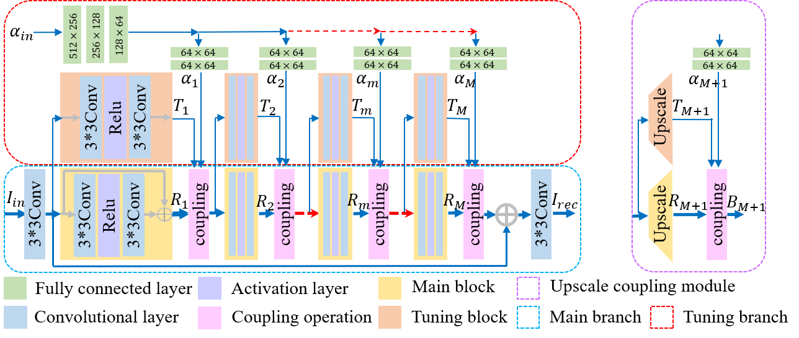
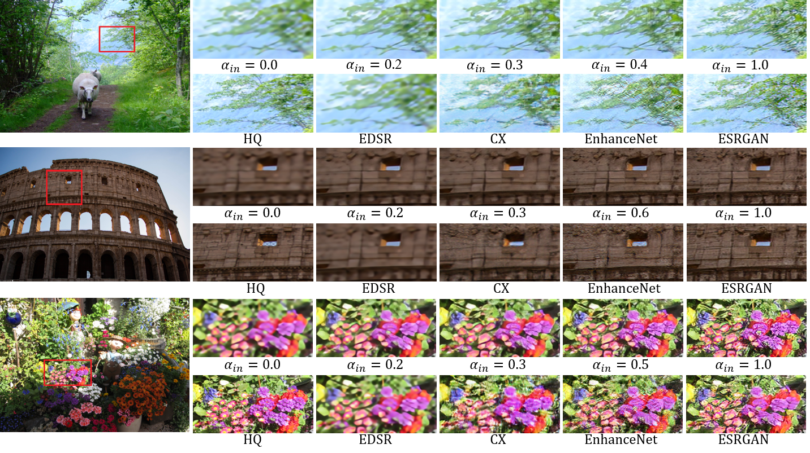
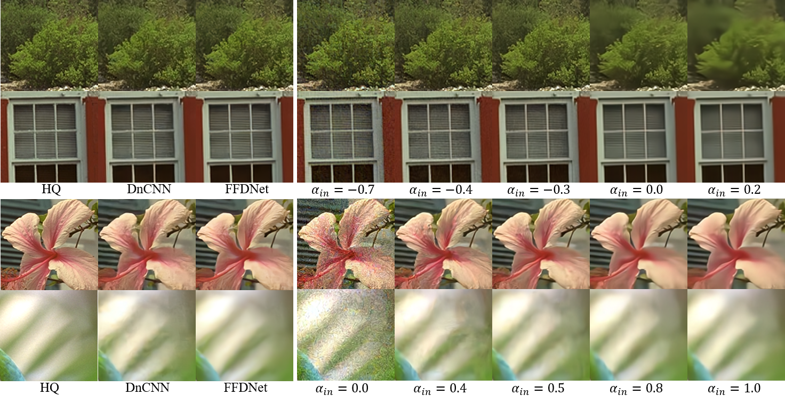
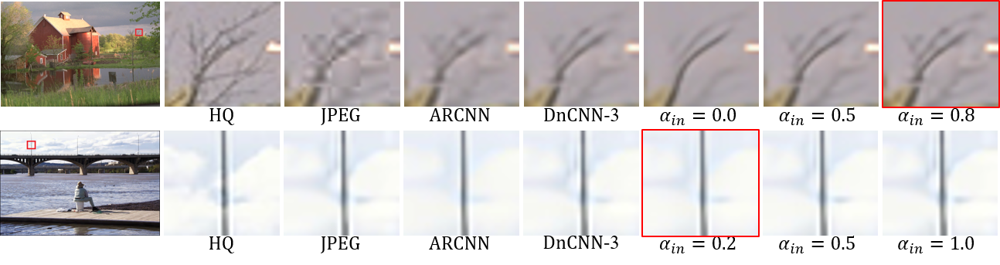
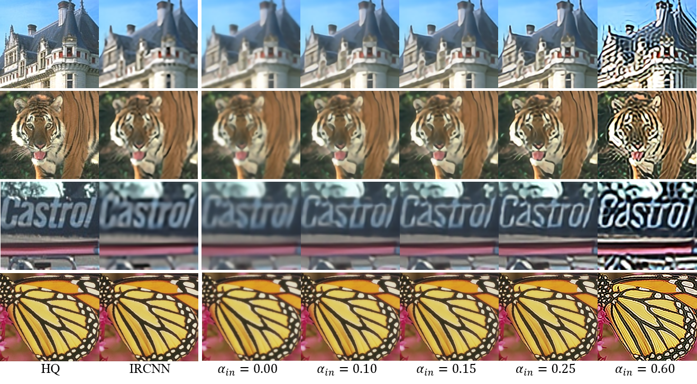

# CFSNet
pytorch code of "CFSNet: Toward a Controllable Feature Space for Image Restoration"（ICCV2019）

#### [[Paper](http://openaccess.thecvf.com/content_ICCV_2019/papers/Wang_CFSNet_Toward_a_Controllable_Feature_Space_for_Image_Restoration_ICCV_2019_paper.pdf)][[arXiv](https://arxiv.org/abs/1904.00634)][[Poster](https://github.com/qibao77/CFSNet/blob/master/CFSNet_poster.pdf)]

<div align=center></div>

Coupling module architecture.



The framework of our proposed controllable feature space network (CFSNet). The details about our proposed CFSNet can be found in [our main paper](https://arxiv.org/abs/1904.00634).

If you find our work useful in your research or publications, please consider citing:

```latex
@InProceedings{Wang_2019_ICCV,
author = {Wang, Wei and Guo, Ruiming and Tian, Yapeng and Yang, Wenming},
title = {CFSNet: Toward a Controllable Feature Space for Image Restoration},
booktitle = {The IEEE International Conference on Computer Vision (ICCV)},
month = {October},
year = {2019}
}

@article{wang2019cfsnet,
  title={CFSNet: Toward a Controllable Feature Space for Image Restoration},
  author={Wang, Wei and Guo, Ruiming and Tian, Yapeng and Yang, Wenming},
  journal={arXiv preprint arXiv:1904.00634},
  year={2019}
}
```

## Contents
1. [Illustration](#illustration)
2. [Testing](#testing)
3. [Training](#training)
4. [Results](#results)

## Illustration

The overall code framework:
```
          CFSNet ── codes
                      └── data
                           ├──deblock_dataset.py
                           ├──denoise_dataset.py
                           ├──sr_dataset.py
                           └── util.py
                      ├──models
                           └── modules
                                  ├── architecture.py
                                  ├── block.py
                                  ├── loss.py
                                  ├── main_net.py
                                  └── tuning_blocks.py
                           ├── CFSNet_model.py
                      ├──settings
                           ├── test
                           ├── train
                           └──options.py
                      ├──utils
                           ├── logger.py
                           └── util.py
                      ├── train.py
                      └── test.py
```                
#### Dependencies and Installation

GPU: cuda 8.0.
Python 3.6.3 (Recommend to use Anaconda)  
Packages: 
```
pip install torch-0.4.1-cp36-cp36m-manylinux1_x86_64.whl
pip install torchvision-0.2.1-py2.py3-none-any.whl
pip install opencv-python
pip install opencv-contrib-pytho
pip install lmdb
pip install scikit_image-0.13.1-cp36-cp36m-manylinux1_x86_64.whl
pip install tensorboard-logger
```
(some .whl packages can be found here: [Google Cloud Disk](https://drive.google.com/drive/folders/1uYOMtNC_xYw9OGuaAs3COAg3fUURdSbH?usp=sharing))

## Testing

We provide some trained models of CFSNet, and you can download them from [Google Cloud Disk](https://drive.google.com/drive/folders/12O5FDgZ99jdbyeyLeAgiM-4ygsoAeq0l?usp=sharing). 
1. Prepare datasets according to task type. (Some datasets can be found in [Google Cloud Disk](https://drive.google.com/open?id=1C0VjWZr2dVQsPyN9jXzGxR-Y0iR9oX0A).)
2. Modify the configuration file (settings/test/*.json) according to your personal situation. (please refer to ['settings/test'](settings/test) for instructions.)
3. Run following command for evaluation: 
```python
python test.py -opt settings/test/*.json 
```

## Training

1. Prepare training datasets according to task type.
2. Modify the configuration file (settings/test/*.json) according to your personal situation. (Please refer to ['settings/train'](settings/train) for instructions.)
3. Run the following command for training:
```python
python train.py -opt settings/train/*.json
```
Note: Our training process consists of two steps, first training the main branch, then training the tuning branch. Therefore, you need to modify the configutation file at different training stages.

## Results

#### Visual Results



Perceptual and distortion balance of “215”, “211” and “268” (PIRM test dataset) for 4× image super-resolution.

<div align=center></div>

Smooth control of distortion and perceptual with control scalar α_in from 0 to 1.



Color image denoising results with unknown noise level σ = 15 (first two rows) and σ = 40 (last two rows). α_in = 0.5 and α_in = −0.3 correspond to the highest PSNR results, respectively.

<div align=center></div>

Smooth control of noise reduction and detail preservation with control scalar α_in from 0 to 1.



JPEG image artifacts removal results of “house” and “ocean” (LIVE1) with unknown quality factor 20. α_in = 0.5 corresponds to the highest PSNR results, and the best visual results are marked with red boxes.



Visual results of single image super-resolution with unseen degradation (the blur kernel is 7 × 7 Gaussian kernel with standard deviation 1.6, the scale factor is 3). α_in = 0.15 corresponds to the highest PSNR results.

<div align=center></div>

Smooth control of blur removal and detail sharpening with control scalar α_in from 0 to 0.8.

## Acknowledgement
Thank [BasicSR](https://github.com/xinntao/BasicSR). They provide many useful codes which facilitate our work.
